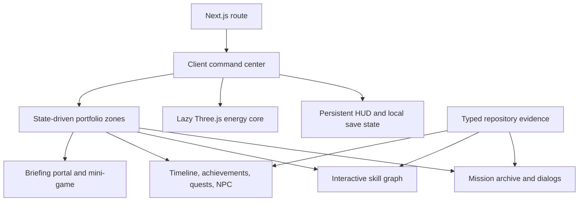

# Anish Kumar: Engineering Command Center

A playable, evidence-based portfolio for [Anish Kumar](https://github.com/Anishhar03). Instead of a traditional scrolling resume, the site presents real engineering work as an explorable command center with missions, skill nodes, a campaign map, achievements, a guide NPC, environmental modes, and a contact portal.

## Experience map

- **Home Base:** cinematic boot, operator profile, headline, availability, and fast mission access.
- **Mission Archive:** six detailed projects with filtering, difficulty, completion, stack, architecture story, challenge, solution, result, source, and live deployment where available.
- **Skill Tree:** four interactive branches and sixteen nodes, each linked to repository evidence rather than a generic logo cloud.
- **Campaign Atlas:** education, Oracle internship, public builder campaign, current direction, achievements, quest board, and a repository-grounded guide NPC.
- **Contact Portal:** recruiter briefing workflow, professional links, transmission feedback, and a small signal-sync game.
- **Hidden systems:** persistent visited zones, day/night simulation, ion-storm weather, optional synthesized UI audio, keyboard navigation, and a classic secret input sequence.

## Featured missions

| Mission | Engineering focus | Stack |
| --- | --- | --- |
| Gita GPT | Grounded AI, provider resilience, ingestion, multi-user scale | React, FastAPI, pgvector, Redis, RQ |
| TripMate AI | Multi-agent planning and offline-first product design | LangGraph, Groq, FastAPI, PostgreSQL, PWA |
| Packet Analyser | Protocol parsing, DPI, flow tracking, filtering | C++17, CMake, PCAP |
| Hotel Security | Role-based operations and a single deployment artifact | Spring Boot, Spring Security, React |
| Microservices Communication | Service ownership, correlation, sidecars, traffic policy | Spring Boot, Envoy, Docker Compose |
| Plainlist | Clean full-stack boundaries and authoritative persistence | React, Django REST, PyMongo, MongoDB |

## Architecture



The 3D scene is dynamically loaded on the client and capped at a low device pixel ratio. UI content stays semantic and independent from WebGL, so the portfolio remains navigable when motion is reduced or canvas rendering is unavailable. Local storage contains only presentation preferences, visited zones, and unlock state.

## Stack

- Next.js 16, React 19, TypeScript, Tailwind CSS 4
- Framer Motion and GSAP
- Three.js, React Three Fiber, Drei
- Shadcn-style primitives with Radix Dialog and Tooltip
- Lucide icons
- vinext, Vite, and Cloudflare Worker output for OpenAI Sites

## Run locally

Requires Node.js 22.13 or newer.

```bash
npm ci
npm run dev
```

Open the URL printed by vinext.

## Quality checks

```bash
npm run lint
npm run verify
npm run build
```

`npm run verify` checks the required experience modules, mission count, critical links, asset integrity, hosting metadata, placeholder text, and common committed-secret patterns.

## Accessibility and performance

- Skip link, semantic landmarks, labeled controls, keyboard shortcuts, visible focus states, and Radix focus management.
- `prefers-reduced-motion` disables nonessential animation; the 3D loop also lowers its particle count and stops camera motion.
- Responsive layouts are explicitly defined for desktop, tablet, and narrow mobile widths.
- Project images use `next/image`; the WebGL scene is lazy loaded and isolated from the content tree.
- Color is not the only state signal. Buttons expose labels, `aria-current`, `aria-selected`, or status text.

## Content provenance

Portfolio claims are derived from Anish Kumar's public GitHub profile and the README, architecture, workflow, or source files of the featured repositories. The LinkedIn URL is included as a contact channel, but no private LinkedIn content is copied into the site. No API token, email credential, or private data is required by the application.

## Deployment

The project includes `.openai/hosting.json` and the Sites Vite adapter. `npm run build` produces the Cloudflare-compatible worker entry at `dist/server/index.js` and client assets under `dist/client`.
